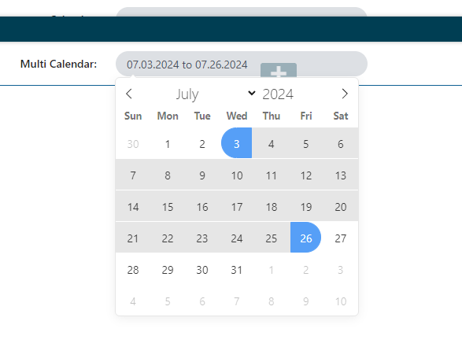

# Configure a multi value Calendar form component

The following properties are configurable in the kentico form builder:
1. Is multi date selection - Configures the calendar component to allow for range selection or multiple dates.

2. Date Format - Configure the displayed date format.

3. Excluded Date Time Data Provider - Here you can select the [Calendar dynamic data provider](./Dynamic-Calendar-Data-Provider.md). Note that setting the minimal/maximal time values in the provider is not relevant when using the multi value calendar component.