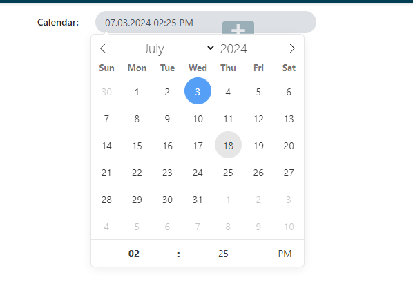

# Configure a single value Calendar form component

The following properties are configurable in the kentico form builder:
1. Show Date Only - Configures the calendar component to use date or date and time format.

2. Time Frame - Sets the number of minutes of each time interval selectable via the time setting arrows.

3. Display in 24-Hour format - Configure whether the time should be displayed in 24-hour format or 12-hour format with AM/PM.

4. Date Format - Configure the displayed date format.

5. Display time in client's time zone -  Configures whether the value should be automatically shown in the client's time zone. If true,
offset is added to the selected time according to user's time zone.
Time is always saved in the server's time zone.
Only Date Time uses the offset. Date only does not convert the time.

1. Excluded Date Time Data Provider - Here you can select the [Calendar dynamic data provider](./Dynamic-Calendar-Data-Provider.md).